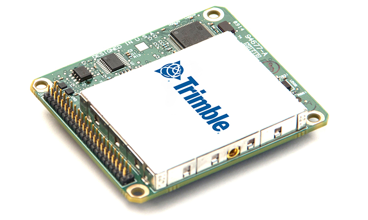
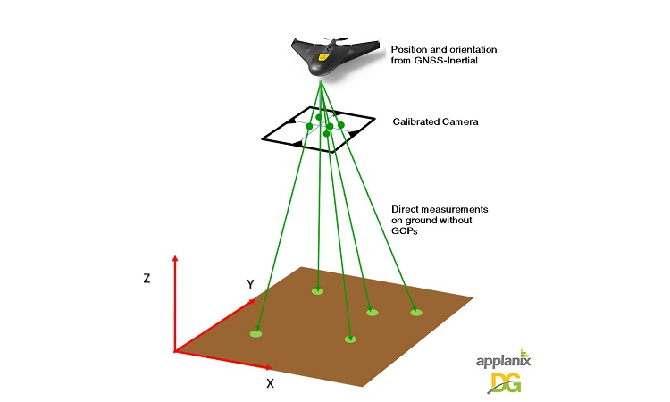
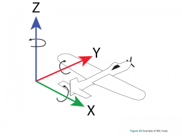
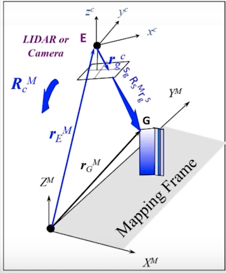

# Applanix

Firma produkująca software i hardware do bezpośredniej georeferencji UAVów. Ich rozwiązania składają się z układu scalonego posiadającego moduł nawigacji satelitarnej oraz sensorów przystosowanych do pracy w UAVach. 

Dodatkowo zapewniają oprogramowanie do przetwarzania danych po wykonanej misji w celu zwiększenia dokładności. 

Technologia ta została stworzona w celu mniejszenia kosztów i zwiększenia efektywności, poprzez [bezpośrednią georeferencję (ang. direct georeferencing)](#direct-georeferencing) każdego punktu zebranego przez sensor, bez wykonywania wielokrotnych nalotów oraz bez konieczności rozstawiania punktów kontrolnych GCP.

## Direct Georeferencing

Pozwala zmierzyć orientacje i pozycję sensora zbierającego obraz. Następnie używa tych informacji, do bezpośredniego określenia geolokalizacji każdego zebranego punktu. Sensorem zbierającym dane może być LiDAR, kamera RGB, kamera NIR, kamera termalna, SAR, Multispectral and Hyperspectral cameras, technika jest praktycznie taka sama. [Wiecej informacji](https://www.applanix.com/dgforuav/index.htm).

### Z czego się składa taki system

1. High performance, multi-frequency and multi-constellation odbiornik nawigacji satelitarnej
2. Inerial Measurement Unit (IMU) na który składa się żyorskop i przyśpieszeniometr.
3. Wysokowydajnościowa, o niskim szumie antena nawigacji satelitarnej.
4. Oprogramowanie czasu rzeczywistego, do przetwarzania i łączenia wszystkich danych w całość.
5. System augmentacji do poprawiania błędów to poziomu centymetrów 

## Jak to działa?

W celu obliczenia relatywnej lokalizacji w czasie do obliczeń bierze pod wagę rotację i przyśpieszenie z układu IMU. Układ IMU składa się z żyroskopu i przyśpieszeniometru na każdą z 3 osi (łącznie 6 sensorów). 

Dzięki temu IMU jest w stanie określić dokładne relatywne przesunięcie  w przestrzeni. 

System jako całość jest dzięki temu w stanie określić w jakiej pozycji i pod jakim kątem była ustawiona kamera/LiDAR podczas wykonywania zdjęcia.

Więcej informacji o systemie GNSS+INS pod [tym linkiem](https://www.novatel.com/an-introduction-to-gnss/chapter-6-gnss-ins/gnss-ins-systems/).

## Produkty

Firma Applanix oferuje kilka wersji swoich produktów. 

- Trimble APX-15 UAV
  
- Standardowy układ  Single board GNSS-Inerial Module
  
- Timble APX-15-EI
  - Jest to wersja APX-15 ale z podwujnym układem IMU
  - Pozwala na poprawne obliczenie dwóch zbiorów parametrów (ramy drona i kamery) Build in stabilized mount support for ease of integration

- Trimble APX-18 
  
  - APX-15 z dwoma antenami w celu  zwiększenia dokładności podczas wykonywania "hovering" oraz  skanowania typu "facade"
  
- Trimble APX-20
  
  -  Bardzo wydajny z podwójnym układem IMU
  
- [POSPac UAV](https://www.applanix.com/products/pospac-mms.htm)
  
  - Oprogramowanie które zbiera wszystkie dane i tworzy bardzo dokładną bezpośrednią georeferencje do dalszych obliczeń (np. określenia dokładnej lokalizacji punktów zebranych przez LiDAR)
  
  
  
  [Dokumnatacja techniczna](https://www.applanix.com/products/trimble-ap.htm?utm_source=trimble)

https://youtu.be/op39OU0H5fg

