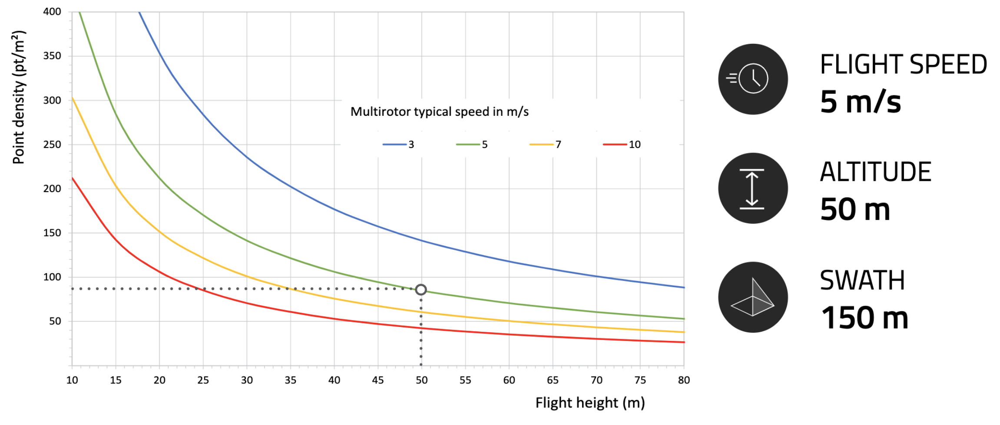
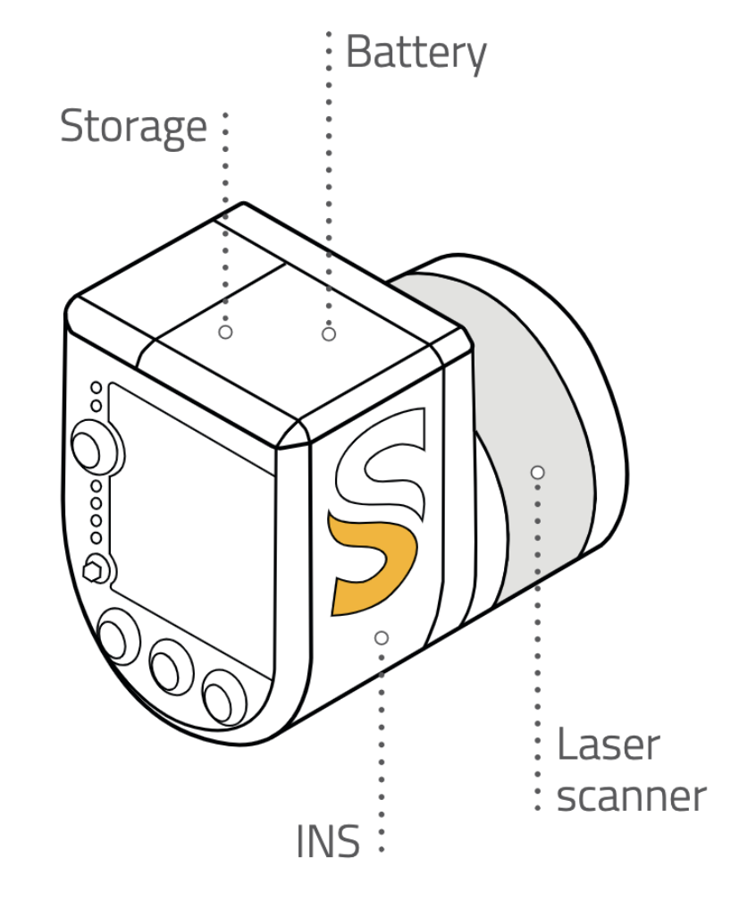

# YellowScan Surveyor

[YellowScan Surveyor](https://www.yellowscan-lidar.com/products/yellowscan-surveyor) to zintegrowane rozwiązane, praktycznie gotowe do użytku, przeznaczony do zastosowań UAV. Łączy w sobie skaner laserowy LiDAR, układ scalony zapewniający georeferencje zebranych punktów oraz baterię zapewniającą 1.5h czasu pracy. Urządzenie używane przez SAFEDAM.

## Specyfikacja

- Skaner: [Velodyne VLP-16](https://velodynelidar.com/vlp-16.html)
- GNSS-Inerial: [Applanix APX15](https://www.applanix.com/products/dg-uavs.htm)
- Długość fali: 903nm
- Rozrzut: 4cm
- Dokładność: 5cm
- Pole widzenia: 360°
- Próbkowanie: 300k/s
- Echo na próbkę: do 2 

- Waga: 1.6kg (wraz z baterią)
- Czas pracy: 1.5h
- Pobór prądu: 15W
- Temperatura pracy: -20 do +50°C
- Rozmiar: L 16 x W 10.5 x H 14cm

## W zestawie

- Walizka a w niej

  - YellowScan Surveyor
  - Ładowarka i 2 baterie
  - Antena i kable do układu GNSS
  - Dokumentacja

- Certyfikat kalibracji boresight

- Rok gwarancji

- Osobisty trening

- Wsparcie techniczne

- Oprogramowanie

  - Applanix POSPac UAV, które pozwala na zwiększenie dokładności po wykonaniu misji

  - YellowScan CloudStation, do generowania i wizualizacji 

  - chmury punktów georeferencyjnych

- Opcjonalnie

  - Uchwyt montażowy dla pojedyńczej lub podwójnej kamery [Sony α6000](https://www.sony.pl/electronics/aparaty-z-wymiennymi-obiektywami/ilce-6000-body-kit) dla drona [DJI Matrice 600](https://rcpro.pl/product-pol-9000-DJI-Matrice-600-PRO.html)
  - YellowScan LiveStation, zestaw monitorowania w czasie rzeczywistym (oprogramowanie i 2 modemy radiowe)
  - Rozszerzenie gwarancji i wsparia technicznego

### Typowe warunki pracy

  

### Budowa

