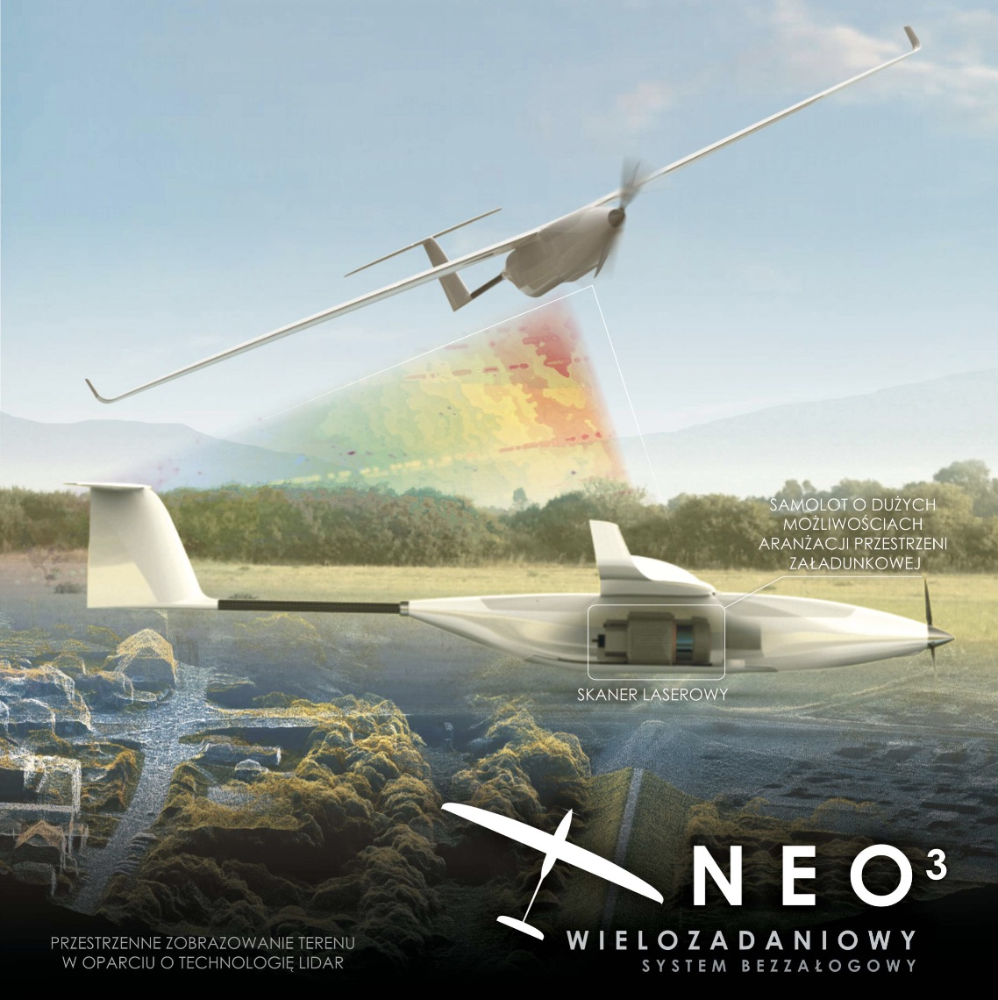

# NEO3

Płatowiec [NEO3](https://uav.com.pl/pl/co-robimy/bsl/neo3) produkcji firmy [MSP](https://uav.com.pl/pl).

## Specyfikacja

Masa:

- masa startowa: 12 kg (wersja fotogrametryczna)
- masa startowa: 15 kg (wersja LIDAR)

Wyposażenie celowe:

- głowica fotogrametryczna (jeden lub dwa aparaty)

- głowica skanująca (LIDAR)

Osiągi:

- promień działania: 10 km*, (ograniczony przez łącze transmisyjne)

- długotrwałość lotu: powyżej 1 godziny*, (rozdzielczość terenowa 5 cm, pokrycie terenu: 20 km2)

- prędkość: 50–120 km/h

- typowy pułap operacyjny: 300–600 m

Start:

- start z ręki – wersja fotogrametryczna

- start z wyrzutni – wersja ze skanerem

Lądowanie:

- klasyczne na „brzuchu”

- ze spadochronem (opcja)

Transport:

- trzy torby/skrzynie,
- wymiary wew. po spakowaniu: 1650 x 350 x 275 mm3

