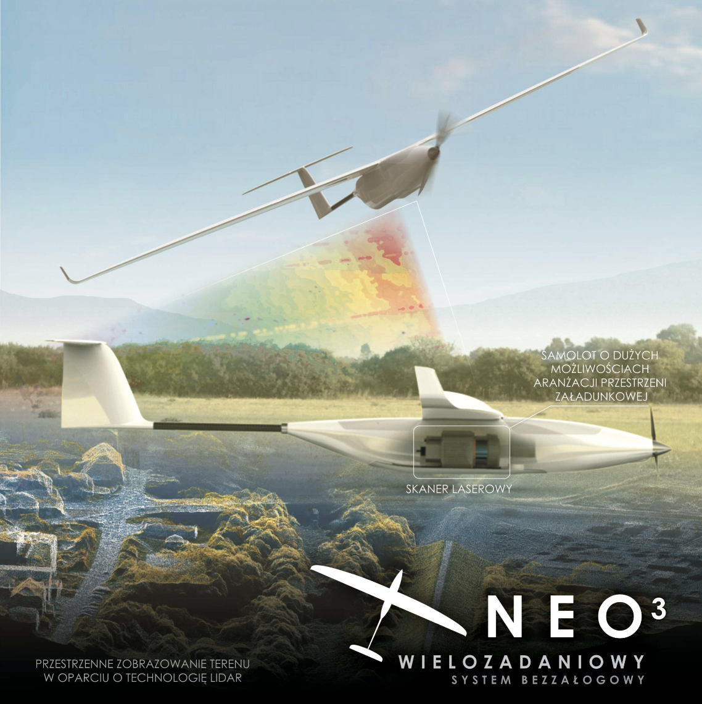
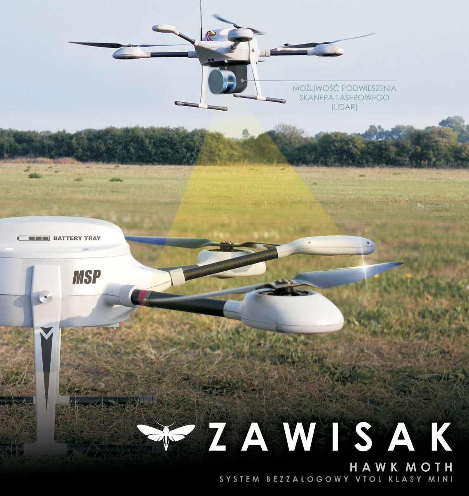

SAFEDAM
=======

Projekt safedam realizuje temat:
*Zaawansowane technologie wspomagające przeciwdziałanie zagrożeniom związanym z powodziami*
Projekt jest finansowany ze środków NCBR w programie Bezpieczeństwo i Obronność.
Excento również dostaje finansowanie z NCBR.
.. note::
    Safedam jest to system który kompleksowo podchodzi do problemu.
    Ma o wiele więcej ludzi zangarzowanych w problem. 
    Dlatego nie powinniśmy czuć się zniechęceni, widząc, ze realizujemy tylko podsystem ich całego projektu.

W skład konsorcjum SAFEDAM wchodzi:
 - Wydział Geodezji i Kartografii
 - Instytut Meteorologii i Gospodarki Wodnej
 - Astri Polska Sp. z o.o.(firma odpowiedzialna za integrację systemów IT)
 - Szender Marcin MSP (firma od której mają drona i samolot)
 - Centralna Szkoła Państwowej Straży Pożarnej

.. note::
    Jak widać część informatyczna nie jest dziedziną dominującą nad tym problemem, wniosek płynący z tego jest taki ze programiści są jedynie odpowiedzialni za implementacje rozwiązań, które tworzą powyższe podmioty. 

Tryb prewencyjny
^^^^^^^^^^^^^^^^

W tym trybie platforma pozwala na:

1. Zbieranie danych pomiarów satelitarnych, kamer fotogramatycznych (zakres RGB), bliskiej podczerwieni (NIR), oraz przestrzennych za pomocą skanowania laserowego (LiDAR), 
2. Analizowaniu ocen zagrożenia dzięki obrazom lotniczym i satelitarnym (ISOK_).
3. Wizualizowanie danych na potrzeby służb hydrologicznych i specjalistów zarządzania kryzysowego
4. Ocena stanu wałów pod kątem wystąpienia zagrożenia.
5. W przypadku identyfikacji obszarów zagrożenia, przekazywana jest informacja do Centrum Modelowania Powodzi i Suszy (CMPiS_) w celu aktualizacji map zagroenia przeciwpowodziowego. 

W trybie prewencyjnym system nastawiony jest na badanie obwałowań oraz ruchu mas gruntu przy normalnym stanie wód. Ze względu na potrzebę szybkiego pomiaru dużego obszaru, zdecydowano o zastosowaniu bezzałogowego samolotu fotogrametrycznego, przystosowanego do przenoszenia skanera laserowego - LIDAR. Został on wyposażona w ultralekki skaner laserowy, dwie cyfrowe kamery kadrowe o dużej rozdzielczości, obrazujące w zakresie RGB i NIR i dostarczające wysokiej jakości obrazy z pikselem kilkucentymetrowym, co
pozwala na generowanie ortofotomap o wysokiej rozdzielczości. Połączenie dwóch takich samych kamer, z czego jedna rejestruje wyłącznie NIR, daje z kolei możliwość analiz danych wielospektralnych.

płatowiec NEO3_ produkcji firmy MSP.

Masa: 
 - masa startowa: 12 kg (wersja fotogrametryczna)
 - masa startowa: 15 kg (wersja LIDAR)

Wyposażenie celowe:
 - głowica fotogrametryczna (jeden lub dwa aparaty)
 - głowica skanująca (LIDAR)
 
Osiągi
 - promień działania: 10 km*, (ograniczony przez łącze transmisyjne)
 - długotrwałość lotu: powyżej 1 godziny*, (rozdzielczość terenowa 5 cm, pokrycie terenu: 20 km2)
 - prędkość: 50–120 km/h
 - typowy pułap operacyjny: 300–600 m

Start:
 - start z ręki – wersja fotogrametryczna
 - start z wyrzutni – wersja ze skanerem

Lądowanie:
 - klasyczne na „brzuchu”
 - ze spadochronem (opcja)

Transport:
 - trzy torby/skrzynie,
 - wymiary wew. po spakowaniu: 1650 x 350 x 275 mm3

Tryb interwencyjny
^^^^^^^^^^^^^^^^^^

W przypadku zaistnienia zagrożenia system przechodzi w tryb interwencyjny, pomaga straży pożarnej oraz służbą zarządzania kryzysowego. UAV dostarcza danych z kamery światła widzialnego oraz termowizyjnego. Dostępne są wtedy podstawowe narzędzia podglądu stanu wałów, pomiaru odległości, objętości, wysokości względnej od lustra wody i wysokości wałów przeciwpowodziowych. Tworzone sa równiez szkice do prowadzonej akcji, oraz dokumentacja dla Straży Pożarnej.

W wyborze platformy w wersji interwencyjnej kierowano się przede wszystkim dyspozycyjnością i łatwością operowania nią oraz jak najszybszą możliwością przesyłania danych w czasie rzeczywistym. Te wymagania spełnia platforma typu wielowirnikowiec, którą jest udoskonalana obecnie wersja maszyny ZAWISAK_ produkcji firmy MSP. Platforma jest wyposażona w głowicę obserwacyjną w zakresie optycznym i termalnym, co umożliwi ciągły monitoring akcji również w warunkach nocnych.

Masy:
 - masa pustego wielowirnikowca: 8,5 kg
 - maksymalna masa płatna: 4 kg
 - maksymalna masa startowa: 16 kg

Prędkości:
 - typowa prędkość lotu: 5 m/s
 - maksymalna prędkość lotu: 12,5 m/s

Wyposażenie celowe:
 - stabilizowana głowica obserwacyjna
 - głowica fotogrametryczna `RGB Sony a6000 <https://www.dxomark.com/Cameras/Sony/A6000---Specifications>`_
 - głowica skanująca (LIDAR) `Yellowscan Surveyor <https://www.yellowscan-lidar.com/products/yellowscan-surveyor>`_
 - wyposażenie dostosowane do wymagań klienta

Wykorzystanie danych z LiDARu
^^^^^^^^^^^^^^^^^^^^^^^^^^^^^

Wczesne wykrycie :ref:`uszkodzeń <enbarkment>`, a szczególnie zmiany geometrii wałów, a tym samym identyfikacja potencjalnych uszkodzeń, daje możliwość szybkiej reakcji w postaci zabezpieczenia lub modernizacji zagrożonego odcinka. Ponadto znajomość precyzyjnych danych wysokościowych, z dokładnością poniżej decymetra, usprawnia zarządzanie akcją ratowniczą, a przede wszystkim pozwala na oszacowanie zagrożenia związanego z przelaniem się wody przez korpus wału (poprzez oszacowanie różnicy wysokości zwierciadła wody do korony wału). Wykrywanie potencjalnych uszkodzeń wału może odbywać się na pojedynczej serii danych pomiarowych (wówczas analizie podlegają wykryte anomalie terenu rozumiane jako zaburzenia struktury wałów) lub na podstawie detekcji zmian terenu w czasie. Aby wykonać model identyfikujący zaistniałe różnice, a wykonane analizy były miarodajne, należy opracować jednoznaczne kryteria i parametry związane z generowaniem NMT, tj. określić optymalną rozdzielczość, rekomendowaną metodę interpolacji etc.

Metodyka
^^^^^^^^

.. _ISOK: https://isokmapy.kzgw.gov.pl/imap_rzgw/Imgp.html
.. _CMPiS: 
.. _NEO3: https://uav.com.pl/pl/co-robimy/bsl/neo3
.. _ZAWISAK: https://uav.com.pl/pl/co-robimy/bsl/zawisak

